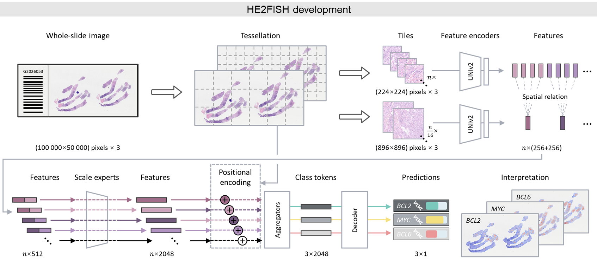

# HE2FISH 
The official implementation of **Data-efficient deep learning for gene rearrangement status prediction in DLBCL** (Pending).
## 1. Introduction
### 1.1 Background
Diffuse large B-cell lymphoma (DLBCL) is the most common lymphoid malignancy, comprising about 30% of adult cases. Current DLBCL examination workflows face challenges because conventional FISH is time-consuming, tissue-intensive, and costly.

To address these issues, we propose a novel framework named **HE2FISH**, trained on large-scale pathology image datasets to assist the DLBCL workflow by providing insights into the macroscopic morphological features that indicate DLBCL gene rearrangement status.

### 1.2 Framework
The main novelty of HE2FISH is illustrated in Figure 1. We propose an attention-based classification model with multi-scale experts to predict three gene rearrangement statuses—BCL2, BCL6, and MYC—in order to assist DLBCL diagnosis.

<p align="center">
    <br />
    <em>Figure 1. Overview of HE2FISH for gene rearrangement status prediction using DLBCL pathology imaging.</em>
</p>

## 2. Quick Start

### 2.1 Installation
First clone the repository and enter the project directory:
```sh
git clone https://github.com/mahmoodlab/HE2FISH.git
cd HE2FISH
```

Intall the dependencies using cmd:
``` sh
conda env create -f environment.yml
conda activate he2fish
```
The code is developed and tested using pytorch 2.6.0 + cu126. Other versions of pytorch are not fully tested.

### 2.2 Data preparation
Place your data under the Datasets/ directory. Please prepare the data using [Trident](https://github.com/mahmoodlab/TRIDENT) or [CLAM](https://github.com/mahmoodlab/CLAM).
Data split script and patient information could be refered by [CLAM](https://github.com/mahmoodlab/CLAM).
HE2FISH extracts patch features using [UNI2-h](https://github.com/mahmoodlab/uni), which is an outstanding computational pathology vision foundation model published at Nature Medicine. We extract features at both 20x and 5x magnifications, and concat them using the coordinates at 20x.

### 2.3 Weights
[HE2FISH weights](https://drive.google.com/file/d/16_nGsVb2ZPeSPs8CqEKR1glKUu-W9dY1/view?usp=sharing) could be saved at "./weights/" (a new dir), which could help you to evaluate the performance of our model.
Of course, you can also train the backbone from scratch.

### 2.4 Training
Training your HEFISH:
``` sh
python trainer_moe_scale.py # only pathology
python trainer_moe_clinic.py # pathology with electric health record
```

### 2.5 Testing
Testing your HEFISH:
``` sh
python tester_moe.py # only pathology
python tester_moe_with_clinic.py # pathology with electric health record
```
We also provide evaluation utilities, including attention map generation (visualization.ipynb), ROC plotting (slide-level evaluation.ipynb or patient-level evaluation.ipynb), confusion matrix plotting (same notebooks), and explainability analyses (SI-MIL).

HE2FISH achieves encouraging performance on all three tasks, improving diagnostic efficiency and revealing pathological attributes contained in DLBCL slides:
<p align="center">
     <br />
    <em> 
    Figure 2. Attention maps generated by HE2FISH.
    </em>
</p>

## 3. Citation (will be updated soon!)
If you find this work or code helpful, please cite:
```
@article{cai2025attrimil,
  title={AttriMIL: Revisiting attention-based multiple instance learning for whole-slide pathological image classification from a perspective of instance attributes},
  author={Cai, Linghan and Huang, Shenjin and Zhang, Ye and Lu, Jinpeng and Zhang, Yongbing},
  journal={Medical Image Analysis},
  pages={103631},
  year={2025},
  publisher={Elsevier}
}
```

## 4. Contributing
Thanks to the following work for improving our project：
- TRIDENT: [https://github.com/mahmoodlab/TRIDENT](TRIDENT)
- UNI: [https://github.com/mahmoodlab/uni](UNI)
- AttriMIL: [https://github.com/MedCAI/AttriMIL](AttriMIL)
- CLAM: [https://github.com/mahmoodlab/CLAM](CLAM)

## 5. License
Distributed under the Apache 2.0 License. See LICENSE for more information.
